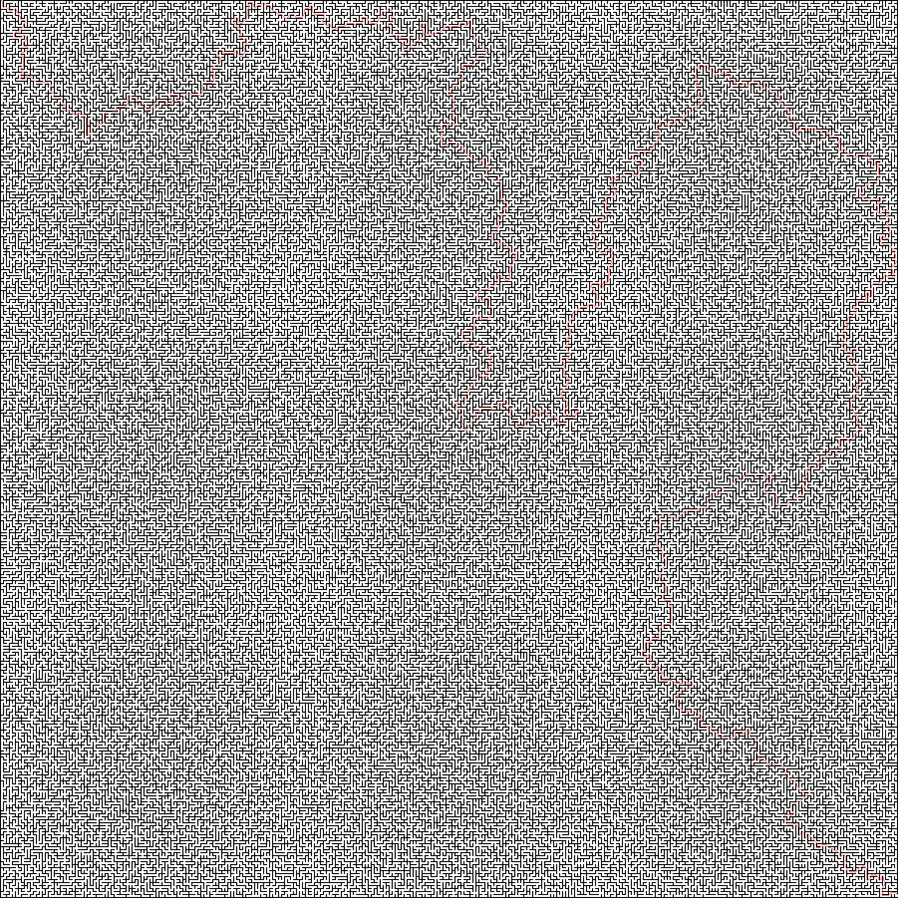

# astar
code dump of an astar implementation w/ python wrapper initially made for my design and analysis of algos course 
build and run main.py for example with a small maze
## Requirements
OpenCV
## example use 
```make all```\
```python3 main.py ./mazes/maze.png ./mazes/soln.png```

## Benchmark
```
loaded maze of shape (1802, 1802)
found path of length  7332 in 0.29267001152038574
```

## Example
